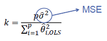

#Advanced Modeling Notes

## Multicollinearity

Occurs when two or more of the explanatory variables in a regression model are highly correlated with each other

## Biased Regression Techniques

These techniques intentionally bias the estimation of the regression coefficients.

They produced biased estimates,  but tend to have more precision than OLS estimates *In the presence of multicollinearity*.

## Principal Components

Principal components orthoganalize the data to remove multicollinearity.

## Principal Components Regression

Before doing principal components regression, you must standardize the response.

Principal components regression *is not* biased until you *remove* a principal component.

### PCR Cautions

- May not always work
	- May have trouble explaining variability in response variable
	- Never blindly drop PC's
- Outliers / Influential observations severely distort the PCs because they alter the variance-covariance matrix

## Ridge Regression

Another technique to solve multicollinearity.

Must standardize *All* variables, including response.

Tends to produce estimates with lower MSE, but higher bias, than OLS.

`k` is a bias parameter which makes the correlation of a variable with itself greater than 1. 

### Determine **k**:

#### 1. Fixed Point

#### 2. Ridge Trace

Look at graph, and estimate optimal **k** based on a range of values of **k** that you plot. The value of **k** occurs when the line turns horizontal. 

Use original data after getting **k**, rather than standardized data.

#### 3. Iterative

Note: Recycle thetas from fixed point. However, you do not want your VIFs to be much lower than one.

### Cautions

- Due to uncertainty of k calculations, there are some that dislike use of ridge reg (or other bias regs)
- Both PCR and ridge regression should be a **last case scenario**
- Deleting/combining variables is preferred because it doesn't introduce bias

## Endogenous Variables

Exogenous variable - Independence of errors
Endogenous variable - Not independent of errors

When you have an endogenous variable, the following can happen:

- Variable can be omitted. Error term can contain the variable
- OLS parameter estimates become biased in terms of standard error

## Instrumental Variables

Variable that is related to the predictor variable (endogenous ones) but not to the error term (it is itself exogenous)

Must have one instrumental variable for every endogenous variable in model

### Two stage least squares

1. Create a regression of an endogenous predictor variable in terms of instrumental variables
2. Regress the response variable on the predicted values of predictor from step 1. instead of original predictor

#### Must check the following in 2SLS:

1. Do we have an endogenous predictor variable?
2. Did we over-specify the model by using too many instrumental variables?

## Endogeneity Test

*H_o* : x_i is exogenous
*H_a* : x_i is endogenous

(want high p-value)

1. Regress x_i on all other variables and instrumental varibles
2. Keep residuals
3. Regress y_i on all variables (except instrumenal ones) and the residuals form the previous step
4. Test coefficient on residual variable

## Over-specification Test

*H_o* : Not too many instrumental variables
*H_a* : Too many instrumental variables

(want high p-value)

1. Estimate by 2SLS and keep residuals
2. Regress residuals on all exoggenous variables (including instrumental ones)
3. Obtain R^2
4. nR^2 ~ chi^2_p where p = #inst.var - #endo.var

## Example of 2SLS (Simultaneous Equations)

## Heteroscedasticity

Does not affect parameter estimates, only affects standard error.

Any inferences under traditional assumptions will be incorrect. Hypothesis tests and confidence intervals based on t, F and chi^2 will not be valid.

Accounting for Heteroscedasticity:

1. Calculate statistics that are robust to heteroscedasticity
2. Account for heteroscedasticity in the estimation process through Weighted Least Squares (WLS)

## Formal Tests for heteroscedasticity

*H_o* : Homoscedasticity
*H_a* : heteroscedasticity

### White's General Test

Looks for relationship between variance of the residuals and functions of the predictor variables

Disadvantages
- Low power in actually detecting heteroscedasticity when it might exists
- If you reject the null hypothesis in the White test, there is no indication of the problematic variables

### Breush-Pagan

Preferred to the white general test because it restricts attention to specific explanatory variables.

### Heteroscedasticity Robust S.E

Fixes the standard errors so that you can trust hypothesis test, but does not fix the problem of heteroscedasticity.

Fixes symptoms, not disease.

## Weighted Least Squares

Used to:

- Limit the influence of outliers in regression analysis
- Giving greater weight to more recent observations in time series
- Stabilize variance to conquer heteroscedasticity

### Feasible Generalized Least Squares (FGLS)

Estimate function h(x_i) to predict variance:

A typical estimation is the power function:

## Anomalous Observations

Outliers - Large standardized residual
Leverage Points - Point that falls outside the normal range in the X-space

Detection techniques:

- Studentized residuals
- Leverage
- Cook's D
- DFFITS
- DFBETA
- Covariance Ratio

*Distributional Outliers* - A distribution with "thicker tails" than a Normal distribution would have a higher probability of producing larger errors than those that would be expected from a Normal distribution.

This causes an increase in the variability in the standard deviation of the errors. 

## Robust Regression

*Robust Regression* techniques handle anomalous observations

2 main goals:

1. Perform almost as well as OLS in uncontaminated data
2. Perform better than OLS in contaminated data

#### M Estimation

Good for outliers.

Focuses on standard residuals instead of sum of square errors and puts a *bounding function* on the residuals

#### Least Trimmed Squares

Good for leverage points.

A single influential observation can break OLS. LTS allows for up to half of your observations to be influential.

#### S-Estimation

Used for MM-estimators.

Minimize an estimate of the spread of the residuals

#### MM-Estimators

Used to for combination of outliers and leverage points

1. Calculate S-Estimator
2. Use S-estimate as initial point in residual scale calculation that is robust (get more accurate estimate of spread of residuals)
3. Put this scale of the residuals into an M-estimator equation

## Panel Data

Looks at:

- **Cross-sectional data**: data measured across individuals at a fixed point in time
- **Time Series**: data measured one individual across successive points in time

Advantages of panel data:

- Increased Sample Size
- Control for unobserved differences between individual subjects

**Balanced:** data with the number of time periods being equal across all of the different cross-sectional individuals

**Unbalanced:** data with an unequal number of time periods across different individual cross-sections
	

### Pooled Regression Model

We assume that individual effects are *fixed* **and** *constant* across all individuals.

Uses same assumptions as OLS.

### Fixed Effects Model

We assume that the subjects we have represent the **entire** population available to study or represent the entire population of interest.

**Assumptions:**

1. For each subject *i*, the following model holds:

2. No perfect collinearity between predictor variables **and** each predictor variable changes across time for some subject
3. After accounting for the unobserved effect alpha\_i, there is no correlation between predictors and errors.
4. Errors are normally distributed with a mean of 0 and a constant variance

#### Least Squares Dummy Variable (LSDV)

Most popular way to estimate a fixed effects model.

Uses dummy variables for each cross-section subject to explain the unobserved effect alpha_i.

SAS calculates following F-test:

- *H_o* : alpha\_i = alpha
- *H_a* : At least one alpha\_i is different

### Time Fixed Effect

Uses a constant alpha term, but includes a fixed time effect

### Two-way Fixed Effects Model

Combine both cross-sectional and time components.

### Random Effects Model

We assume that our subjects are selected from a larger population, and that we randomly pick our cross-sections.

Same model as the fixed effects model, except every alpha\_i can be written as:

**Assumptions:**

1. For each subject *i*, the following model holds:

2. No perfect collinearity between predictor variables **and** each predictor variable changes across time for some subject
3. After accounting for the unobserved effect alpha\_i, there is no correlation between predictors and errors **and** u\_i has a mean of 0 and constant variance.
4. Errors are normally distributed with a mean of 0 and a constant variance

#### Testing for Random Effects

- LM test:
	- *H_o* : Var(u) = 0
	- *H_a* : Var(u) > 0
- Hausman Test:
	- *H_o* : Random effects good
	- *H_a* : Fixed effects good

